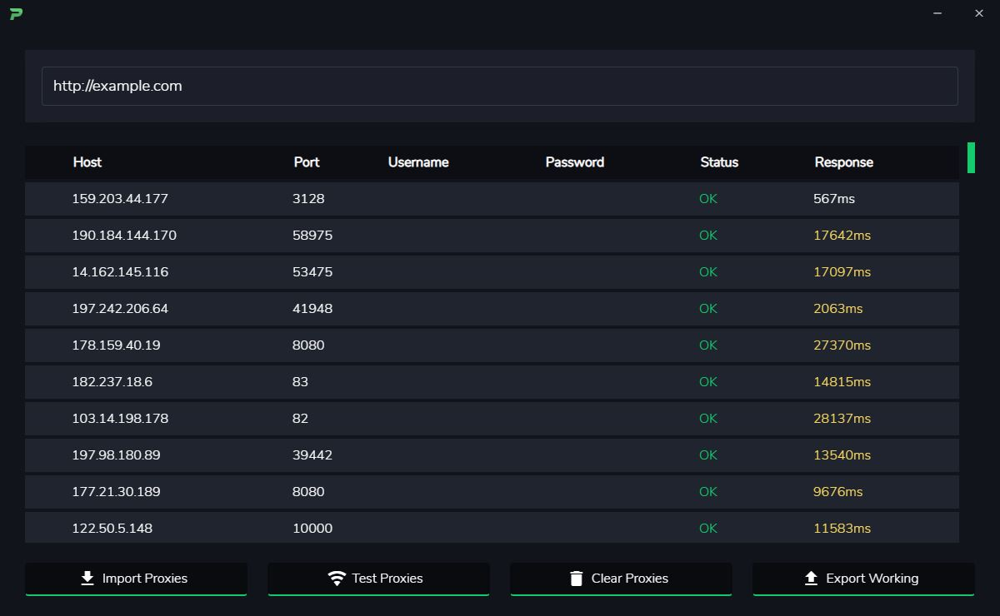

# Ping

## Proxy testing made easy.

Ping is a simple desktop application for testing HTTP/S and user authenticated proxies.

## Download
You can download the latest windows binaries on our releases page or build the source code yourself.

## Build
You'll need NodeJS installed on your computer and accessible in your command line. _(Note: you can run Ping on Windows, macOS, or Linux if you're building from the source.)_

Open a command line in the source root directory and run the command `npm install` to install all the required dependencies. If those install successfully, you can then run `npm run electron:serve` and the program window should open.